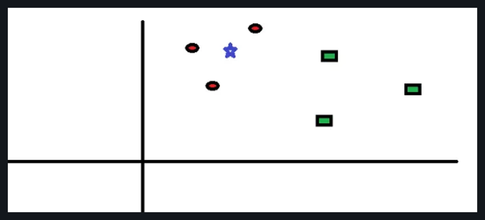

# What is `KNN` (K-Nearest Neighbor) Algorithm?

### The k-Nearest Neighbors (KNN) algorithm is a supervised machine learning technique used for classification and regression tasks. It's a straightforward and intuitive algorithm that makes predictions based on the similarity of data points.

## How Does the `KNN` Algorithm Work?

### Let's take a simple case to understand this algorithm. Following is a spread of red circles (RC) and green squares (GS):

### You intend to find out the class of the blue star (BS). BS can either be RC or GS and nothing else. The `K` in KNN algorithm is the nearest neighbor we wish to take the vote from. Let's say `K = 3`. Hence, we will now make a circle with BS as the center just as big as to enclose only three data points on the plane. Refer to the following diagram for more details:

### The three closest points to BS are all RC. Hence, with a good confidence level, we can say that the BS should belong to the class RC. Here, the choice became obvious as all three votes from the closest neighbor went to RC. The choice of the parameter K is very crucial in this algorithm. Next, we will understand the factors to be considered to conclude the best K.

---

## Here's a basic explanation of how the KNN algorithm works:

1. **Understanding the Concept:**
   - Imagine you have a dataset with different classes (categories) of data points, and each data point has features (attributes).

2. **Data Representation:**
   - Each data point is represented as a point in a multi-dimensional space, where the dimensions correspond to the features.

3. **How KNN Makes Predictions:**
   - When you have a new data point that needs to be classified, KNN looks at its k-nearest neighbors in the feature space. "k" is a user-defined parameter representing the number of neighbors to consider.

   - The algorithm measures the distance between the new data point and its k-nearest neighbors. Common distance metrics include Euclidean distance or Manhattan distance.

   - The new data point is then assigned to the class that is most prevalent among its k-nearest neighbors. For regression tasks, the algorithm might return the average value of the k-nearest neighbors.

4. **Choice of K:**
   - The value of k is crucial. A smaller k value means the decision is influenced by a small number of neighbors, which can make the model sensitive to noise. A larger k value makes the decision more stable but might overlook local patterns.

5. **Advantages and Considerations:**
   - KNN is simple and easy to understand. It doesn't require training a model; instead, it memorizes the entire dataset.

   - However, KNN can be computationally expensive, especially with large datasets, as it needs to calculate distances for every new data point.

   - It's sensitive to irrelevant or redundant features, and the choice of distance metric and k can impact its performance.

In summary, KNN is a versatile algorithm suitable for various types of data, but its effectiveness depends on the choice of k and the characteristics of the dataset. It's commonly used in scenarios where the decision boundaries are not well-defined or when the underlying patterns are complex.

---

## Confusion Matrix , F1 Score Evaluation and accuracy

